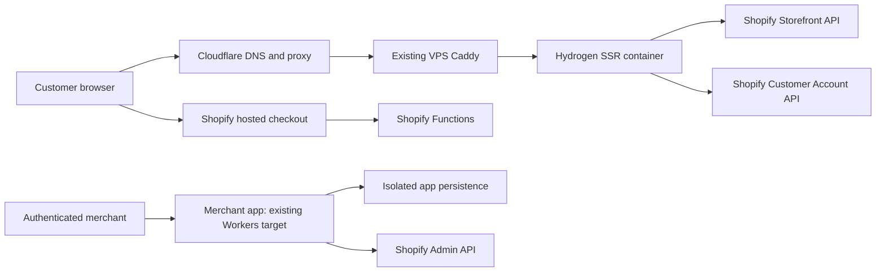

# RegenAI — master build and completion plan

Updated: 2026-09-21. Status: **STOPPED at owner request; preserve unfinished B05 runtime and B06 Hydrogen migration.** B06a selected-design preview has earlier passing evidence; latest integration changes have not passed the full gates. Resume only on owner instruction. See [build status](docs/BUILD-STATUS.md) and private recovery checkpoint. No completion, production readiness, traffic capacity, uptime or legal certification is claimed.

## 1. Delivery contract and definition of completion

RegenAI remains a **Shopify headless-commerce project**, using Hydrogen for the customer storefront. The visual React/Vite preview is a design milestone, not the finished Shopify storefront. Preserve the current bone/blue design, original Blender product assets, Three.js inspection and accessible shopping flow while connecting real Shopify data.

### Owner scope clarification — client-facing portfolio demo
The owner confirmed RegenAI is a demo that must look like a real business for client review. Deliver polished realistic UX and genuine sandbox commerce/admin behavior; visibly disclose demo/test checkout and synthetic product/review data where relevant. Do not present generated products as proven medical devices, fabricate endorsements, or imply legal certification. Production engineering controls and scale evidence remain in scope. Actual sales, real payment processing, merchant-specific legal signoff, verified product conformity and paid scale provisioning are launch prerequisites, not silently claimed complete. No capability is automatically deferred; resolve feature scope and evidence individually.

Three separately reported milestones prevent partial work being called the whole project:

| Milestone | Required outcome | Current state |
|---|---|---|
| M1 Local design review | F01–F12 frontend criteria; working review URL; original assets and fixture shopping flow | Implemented/tested; owner's final visual acceptance not recorded |
| M2 Integrated Shopify project | Reproducible Hydrogen build; real dev-store browse/cart/test checkout/accounts; authorized merchant app; verified eligible Functions; required release gates | Not complete |
| M3 Full selected platform and release | M2 plus selected commercial/recommendation tasks, applicable P controls, S01–S06 scale-readiness proof, measured deployment, backup/restore, rollback, documentation and owner release review; S07 capacity tests separately gated | Not complete |

The plan includes all established project layers. Capability-gated work stays **blocked or awaiting owner scope decision**, never silently marked done. Owner-approved deferrals must be named in the final scope ledger; completing M2 alone must not be reported as finishing every historical feature proposal.

Current authorization: the owner has now instructed full supervised implementation, with Luna low as implementer and frequent recoverable project records. Local Docker/Kubernetes configuration is authorized. Supervisor updates `memory/implementation-checkpoint.md` before and after bounded tasks and during long operations. Preserve existing dirty work. Paid actions, concrete deployment approval, external communications and locked public-document updates retain their separate gates.

## 2. Evidence baseline — facts, not assumptions

This section combines same-session source inspection with previously saved test evidence. Historical test results must be rerun when their inputs change.

| Area | Verified evidence | Consequence |
|---|---|---|
| Local UI | `docs/FRONTEND-REVIEW.md`: 34 unit tests, preview type/lint/build, Chrome flows, seven axe states; original sources retained | Preserve and integrate; do not rebuild the design from scratch |
| Shopify storefront | `packages/storefront`: Hydrogen 2026.4, React 18, React Router 7, real legacy route/loaders plus separate preview | Port views into route modules; do not put a nested BrowserRouter inside Hydrogen |
| Runtime | `server.ts`, `app/lib/context.ts`, `vite.config.ts` use Worker fetch/context, global caches, waitUntil and mini-Oxygen | A Node/VPS server adapter and runtime proof are required |
| Build gates | B02 root/direct storefront and app/UI builds, type checks and 34 tests passed; B04 focused 14 tests pass; clean Linux install passed, latest app flag/account-field fixes pass Windows root typecheck and app build; clean Linux rerun active | Fresh candidate verification precedes runtime integration |
| Dependencies | First targeted repair installed; root audit 69→63, critical 1→0; valid dependency tree; install-script policy verification ongoing | Remaining 45 high findings require repair/reachability review; no force-upgrade or blanket script approval |
| App auth | `auth.callback.tsx` stores access_token directly; no encryption call despite SQL comment; state uses KV get/delete | Add tested token protection and atomic replay defense; do not assert encryption exists |
| Admin data | `admin.reviews.tsx` loader queries pending rows without explicit authenticated shop predicate | Stop release until route authentication and tenant isolation are proven |
| Environment data | `packages/app/wrangler.toml` repeats D1/KV resources across preview/staging/production | Never test destructive migrations against shared bindings; isolate environments |
| Functions | Four extension crates + shared crate in `packages/app/Cargo.toml`; schemas/config use older pinned versions | Revalidate schemas, exports, WASM and activation; historic test count is not current proof |
| CI | Fixed remote preview URLs; some continue-on-error or successful skips | Candidate-revision checks must replace misleading green results before release |
| Existing hosting | Earlier native inventory found storefront/app production and preview Workers; snapshots private | Preserve until deliberate, verified cutover; do not delete old resources |
| Shared server/domain | Shared infrastructure records describe an existing Contabo Docker/Caddy VPS and Cloudflare-managed domain | Reuse candidate; live capacity, host availability and billing not rechecked this planning session |
| Store capabilities | Historical Plus-development-store references and Oxygen access denial in ADR-011 | Requery current shop/channel/scopes/feature eligibility; do not infer current plan from old ADR |

Historical ADR-011 includes an incorrect broad implication that Oxygen always requires production Plus; current official documentation does not support that blanket claim. Keep the historical denial evidence, but use current store eligibility checks. Historical ADR-021 describes KV as suitable for one-time OAuth state; KV get/delete is not atomic. Preserve history and record superseding decisions before implementation.

## 3. Target architecture and hosting decision

**Intended storefront target:** existing Contabo VPS, Docker Compose, Node runtime adapted for installed Hydrogen, Caddy reverse proxy and Cloudflare DNS/proxy. Exact hostname/port are configuration, assigned only after inventory. The proposed project subdomain is recorded privately. No second domain purchase is planned.



Responsibilities:

- **Shopify:** commerce source of truth: products/variants, inventory, orders, checkout and Function execution. Self-hosting does not remove Shopify account/plan requirements.
- **Hydrogen on VPS:** customer UI, SSR, server loaders/actions, secure sessions and storefront caching. The Vite fixture harness is local-only design tooling.
- **Cloudflare:** DNS/proxy; per-route caching/security configuration must preserve cart, account, OAuth and webhook behavior. A custom domain alone does not require moving commerce off Shopify.
- **Caddy/Compose:** host routing, origin HTTPS, bounded containers, health/restart behavior; preserve shared services.
- **Merchant app:** recommended initial target remains existing Workers/D1 architecture to avoid an unrequested database migration. First fix isolation/auth. If the owner wants the app on VPS too, supervisor writes a persistence migration decision and restore/parity proof before changing adapters. Do not treat D1 as a local Node database.
- **Functions:** built locally and released through Shopify app tooling; never installed as a substitute checkout on the VPS.
- **Recommendations:** deterministic baseline first; evaluated optional AI behind server settings. No public model credential.

Self-hosting is supported, but the official guide carries a post-2025-05 compatibility warning. For installed Hydrogen 2026.4, supervisor must inspect installed exports/types and React Router templates. A local production-mode container spike proves request/context/session/cache/streaming behavior before the VPS decision becomes an implemented architecture. Do not remove Oxygen/Workers packages blindly or upgrade to a preview architecture merely because documentation is newer. [R1–R3]

If the spike cannot pass, supervisor reports the specific blocker and compares the existing Workers path; no silent hosting substitution. Document any approved target change in a new ADR and this plan.

## 4. Global-rule enforcement for every agent

The actual owner global rules are authoritative. This matrix maps them to project behavior; it does not edit them.

| Global rule | Required project enforcement |
|---|---|
| 1 Research first | Official version-matched docs/registry/schema before significant work; record source/date and uncertainty |
| 2 Native inventory | Shopify APIs; Cloudflare zones/DNS/Workers/D1/KV inventories plus available billing; server Compose/listeners/resources. No guessed resource creation |
| 3 Verify before acting | Written acceptance/repro, configuration inventory and reviewed approach before implementation |
| 4 Verified claims | Per-task evidence; state missing/skipped gates and distinguish historical from current results |
| 5 Cost approval | Fresh explicit cost warning/approval before chargeable calls, upgrades or purchases; no top-up/cap change. Completed one-image approval is consumed; no video approval |
| 6 Documents | No Google Doc/.docx rewrite or `my-project-view/` changes without explicit request. If later requested, edit existing document and verify PDF refresh |
| 7 Usage/provider | No invented subscription meter or savings claim; no automatic checkpoint at a guessed threshold; use switch-provider skill only when requested |
| 8 Credentials | Verify Git ignore first; actual available values in private root CREDENTIALS.md; separate environment records, preserve legacy values, unknown remote values explicitly unknown; never echo secrets |
| 9 Local first | Snapshot/hash live files to be touched, reconcile any newer live changes locally, verify locally, deploy only authorized result, prove post-deploy parity |
| 10 Honesty | Identify flawed assumptions, unsupported claims and failed checks directly; don't label a mock feature real |
| 11 Dossier | Update private PROJECT-DOSSIER.md first; seven required sections; append incidents, retain lessons; public docs scrubbed from it |
| 12 Configuration | Typed settings + safe env examples + validated content; provider/model/version/prices/timeouts not embedded in business logic; regression audit |
| 13 Tests | Personal manual scripts in ignored own folder; never delete; genuine CI tests remain tracked |
| 14 Security pipeline | Fix scanner findings; never disable/bypass hooks or suppress detection. Verify pre-commit and CI wiring; paid review job stays off |
| 15 Gates/review | Spec before code; one bounded feature; tests/type/lint/security/build, real-flow verification and independent fresh-context review; escaped bugs enter DEFECT-LOG.md |
| 16 Memory | All project memory in ignored root memory/; MEMORY.md index only; no external project-note store |
| 17 Rule sync | No global rules change requested here. If later requested, minimally synchronize all five existing instruction files and verify all five |

Public plan contains no secrets, infrastructure IPs, account identifiers or key locations. Source-scoped private records own those values. A known earlier shared-credential exposure remains a private follow-up: supervisor must assess/rotate with the owner before relying on that credential for release; never copy it into logs or Luna prompts.

## 5. Supervisor and Luna operating protocol

After the owner explicitly says start:

1. **Supervisor** re-reads current checkpoint, dirty worktree, task dependencies and relevant live-drift evidence. Protect existing uncommitted work; never reset it. Establish one feature branch/isolated checkout when appropriate without losing current work.
2. Supervisor researches the chosen task, writes acceptance/repro first, chooses configuration ownership, and approves a small implementation approach.
3. **Luna (`gpt-5.6-luna`, low reasoning)** receives a fresh bounded task packet, not the entire ambiguous backlog. If that model is unavailable, report it; do not silently substitute or route through a new paid provider. Hosted Luna is not an offline local model. Actual billing depends on the available session/provider; no cost saving is guaranteed.
4. Luna edits only its assigned local files and runs specified checks. It reports failure evidence immediately instead of weakening tests or expanding scope. Default: one implementation task at a time. Disjoint work may run in parallel only when supervisor explicitly coordinates ownership.
5. Supervisor inspects diff/configuration/security and exercises actual flows. Return precise defects to Luna. Supervisor retains architectural decisions, auth/data design, runtime migration, production credentials, paid requests and release control.
6. A reviewer in a fresh context that did not author the change compares diff to criteria. Fix all blocking findings. If unavailable, report missing review; do not invent a verdict.
7. Update dossier, task evidence/checkpoint and plan status. Give owner concise milestone reports and review URLs. Task completion is separate from deployment authorization.

### Required task packet (copy for every assignment)

```text
Task ID / title:
Dependency evidence and current revision/worktree state:
Goal (one observable behavior):
Read first (exact existing files and official sources):
Allowed edit files; explicitly forbidden surfaces:
Inputs and configuration/data owner:
Acceptance checks (numbered; include failure/edge cases):
Repro or baseline command/result:
Implementation outline (small, reviewed steps):
Exact verification commands and real browser/API flow:
No remote mutations, paid calls, secret printing, commit/push or deployment.
Escalate if: schema/runtime mismatch, missing authorization/access,
new dependency/provider, live drift, data migration or scope expansion.
Return: files changed, diff summary, checks with exit/results, screenshots/
request evidence, risks, remaining work. Do not say done without evidence.
```

Task states: `not-started`, `in-progress`, `review-needed`, `verified`, `blocked`, `owner-deferred`. A blocker needs a concrete cause and next action. Never mark work verified because time/context is short. Repeated corrective cycles trigger supervisor re-analysis rather than blind retries.

## 6. Configuration and data ownership

| Variable data | Single owner / implementation requirement |
|---|---|
| Demo catalog, prices, options, interface copy, finder questions | Existing validated app/content files; fixtures never silently replace live Shopify data |
| Real catalog, prices, inventory, availability | Shopify response mapped to typed view models; currency-aware decimal handling, no universal two-decimal assumption |
| Brand style, motion, 3D transforms | Existing recovery CSS/config and original assets; reduced-motion/poster fallbacks preserved |
| Runtime host/port, origin, proxy policy, session/cookie settings | Typed server settings populated from environment, mirrored by safe env examples |
| Shopify domains/API versions/scopes/timeouts/retries | Central server provider/settings boundary; stable protocol syntax centralized separately |
| URLs, callback allowlists, checkout hosts, market/feature flags | Typed per-environment deployment settings validated at startup |
| Session/encryption/provider secrets | Approved secret injection; actual values privately recorded; none in client bundle/container layers |
| Function thresholds/messages/rules | Versioned validated rule data or Shopify-owned metafields; shared contract with discovery rules |
| AI endpoint/model/version/prompts/budgets | Typed server config + versioned prompt/rubric data; paid-disabled default until approved |
| DNS/Compose names, image digest, volumes, allocated port | Project deployment manifest; allocation after inventory; private access details elsewhere |
| Analytics events/retention | Reviewed allowlist and retention config; no finder answers or tokens in logs/analytics |

Before claiming completion, search public source, staging/history and built client assets for secrets/URLs/models/paths/duplicated defaults; verify ignores; compare env names with typed settings/examples; prove provider/price/timeout changes require config/data edits only. Report secrets found yes/no, moved values, and intentionally fixed constants. Fail a regression test when obvious credential or provider literals return to business modules.

## 7. Phase A — preserve and accept the frontend

Status: **owner selected the newly built recovery frontend for integration; preserve its design**. Full evidence and criteria remain in `docs/FRONTEND-SPEC.md` and `docs/FRONTEND-REVIEW.md`; this plan does not rewrite their historical results.

| ID | Owner and files | Bounded work | Acceptance / dependency |
|---|---|---|---|
| A01 | Supervisor; current review/checkpoint | Confirm owner feedback and exact accepted visual scope | Owner explicitly selected the newly built frontend; no additional visual change requested |
| A02 | Luna; recovery views/content/CSS only | Apply one requested visual change at a time; preserve assets, performance/fallback intent | Relevant F01–F12 rerun; screenshots at 390/768/1440 plus keyboard/zoom; A01 |
| A03 | Supervisor; asset ledger | Keep six editable Blender sources, web variants, GLB, approved image and provenance | No absent video CTA; no generated claims/endorsements; no extra generation without cost gate |

First frontend review is already delivered. These tasks are refinement, not permission to replace the design with generic templates.

## 8. Phase B — foundation, Node runtime and real Shopify integration

**Entry:** owner start command. **Exit:** M2 customer storefront runs through normal Hydrogen build/server with real sandbox commerce. Work B01–B05 may proceed while visual feedback is pending; B06 ports the owner-selected new frontend; A02 applies only if specific refinements are requested.

| ID / dependency | Read/edit scope | Implementation contract | Required acceptance proof |
|---|---|---|---|
| B01 / start | Supervisor; memory/live-snapshot, relevant deployed versions and source, Git state | Reinventory Shopify/Workers and obtain live source/artifact mapping; compare files before touching deployed routes. Reconcile newer live code locally. Inventory scopes, publication, plan, channels, test payment setup, app distribution and Functions eligibility | Dated capability matrix + source hashes. If bundle-only evidence cannot prove parity, record unresolved mapping and prepare isolated candidate; no overwrite/cutover |
| B02 / B01 for deployed paths | Luna; package scripts, runtime pins, codegen config, app/UI types | Reproduce root build-directory failure and missing types; repair correct working directory/explicit project selection; align runtime/lockfile; fix errors rather than bypassing codegen/typegen | Root build/type/lint and workspace builds reproduce on fresh install; no handwritten generated GraphQL types or type-error suppressions |
| B03 / B02 | Supervisor researches; Luna scoped dependency/config changes | Trace audit dependency paths and native install-script needs; verify real registry versions; apply narrow upgrades/patches; enable only verified required scripts; verify hook/pre-commit/CI scanning | Re-audit runtime/build/dev reachability; critical/high exploitable findings resolved before release; any residual needs written risk decision, never “all clear” |
| B04 / B01–B03 | Supervisor contracts; Luna settings modules/env examples | Inventory current app/storefront hardcoded API version/scopes/domains/limits; build typed validated server settings; isolate public vs private settings | Missing/invalid settings fail closed; config-only provider changes; secret/config regression tests and full gates |
| B05 / B02–B04 | Supervisor designs; Luna server.ts, context/session, entry.server, Vite/RR configs, proposed deploy container files | Node/Hydrogen SSR spike using installed-version APIs. Adapt request headers/streaming, cache interface, background work, secure cookie commits and graceful shutdown; keep Hydrogen context | Local production container serves SSR route/assets/404; session survives navigation; separate buyers cannot share cache/cart; abort/error paths tested; restart and shutdown verified. No VPS migration yet |
| B06 / B05 + visual decision | Luna; app/features/recovery, root.tsx, routes, CSS | Extract presentational views from preview routing; SSR-safe window/localStorage/matchMedia effects; one route tree, main, overlay provider and cart source | SSR content without WebGL; hydration has no mismatch; back/forward/reload/deep link work; client-only 3D lazy loads; approved design comparison |
| B07 / B04–B06 | Luna; typed catalog adapter + collection/search/product loaders | Fixture/Shopify adapter contract; generated queries; publish/seed only authorized synthetic dev-store records, never overwrite unrelated products. Map real variants/media/options/prices | Real published Shopify product/collection IDs; search/filter/sort/pagination; absent image, long title, sold-out/missing variant, API timeout/404; no fictional fallback in live mode |
| B08 / B07 | Luna; cart route/action, Bag adapter, session/fragments | Hydrogen/Storefront cart, validated variant/quantity mutations, server session persistence, mutation errors; authoritative Shopify totals; fresh checkoutUrl from Shopify | Add/update/remove/mixed variants; two browsers isolated; inventory/race/retry failures visible; test checkout reaches Shopify. No real charge/order authorization inferred [R4] |
| B09 / B08 | Supervisor auth contract; Luna account routes/settings | Customer Account API flow with configured callback/origin, state/PKCE/session behavior through official supported approach; order/address views limited to actual grants | Login/logout/expiry/error; cross-customer denial; no account tokens in logs; genuine sandbox order history, no fake success [R5] |
| B10 / B07–B09 | Luna; root SEO/meta/content/policy/consent routes | Real canonical/robots/sitemap/status codes, content metaobject mapping, owner-approved policies, consent-gated analytics; remove legacy fabricated clinical copy | Canonical matches configured domain; true HTTP404; no indexation of preview/private/cart; structured data reflects visible reality; scripts obey consent |
| B11 / B06–B10 | Supervisor + fresh reviewer | Run all gates and real dev-store acceptance; retain fixture mode explicitly for deterministic tests, retire duplicate production routes | M2 customer flow evidence plus responsive/a11y/motion/network failure and SSR performance; no Vite dev server shipped |

B08 security detail: preserve separate session/cart cookies, allowlist configured checkout hosts, pass buyer IP only from trusted proxy-derived request data where Shopify requires it, never trust arbitrary client forwarding headers. Fetch current checkoutUrl rather than constructing a payment URL. [R4]

## 9. Phase C — authenticated merchant app and Functions

**Entry:** B01 capability/drift matrix and B02–B04 foundation. C work may be scoped independently of the visual port, but customer release requires all exposed admin/API paths safe. Existing app remains Worker-targeted unless a separate migration is accepted.

| ID / dependency | Files / bounded work | Acceptance |
|---|---|---|
| C01 / B01–B04 | Supervisor chooses embedded/non-embedded auth approach using actual distribution; Luna `app/lib/shopify.ts`, auth routes and middleware | Valid install/session flow; invalid HMAC/state/shop/session denied; no manual shortcut that trusts a shop query parameter; supported SDK assessed before keeping custom auth [R6] |
| C02 / C01 | OAuth persistence and migration; browser-bound state consumed atomically; token encryption/key-versioning with no plaintext debug output | Concurrent/replayed callbacks cannot both succeed; tampered/expired state rejected; encrypted persisted values; controlled key rotation/migration tested on local data. KV get/delete is not accepted as one-time semantics [R7] |
| C03 / C01 | `admin.reviews.tsx`, all loaders/actions; authenticated shop-scoped repository, least privilege roles | Unauthenticated access denied, shop-A cannot read/mutate shop-B, CSRF/session checks, tenant predicate on every query |
| C04 / C02–C03 | `wrangler.toml`, environment adapters and migrations | Preview/staging/production data/session resources isolated. Read-only inventory precedes any resource creation. Local restore first; bounded, authorized remote migration with rollback; never reuse production DB for tests |
| C05 / C03–C04 | Review detail/diff + approve/reject/request-changes with required note, concurrency/version check and append-only audit | Allowed transitions persist, double-approval prevented, forbidden mutation denied, error state honest; audit identifies authenticated actor. Do not invent clinician approval |
| C06 / C05 | Protocol/catalog associations and content publishing workflow | Validated create/edit/archive/version flows; publishing requires approved record; no unapproved medical claims or real patient adherence data |
| C07 / C01–C04 | Webhook routes, event inbox/idempotency, bounded processing/reconciliation | Raw-body HMAC verified before parse; duplicate/out-of-order/replayed delivery cannot duplicate action; tenant association trusted; uninstall revokes tokens; privacy topics handled where required [R8] |
| C08 / B01 + B04 | Four existing Rust crates/shared rule schema/TOML/GraphQL | Pin supported target schemas and prove output/export compatibility with actual Function runner, not Rust unit tests only; verify WASM path/size/current limits; no arbitrary network/LLM call from run target [R9] |
| C09 / C08 + C05 | Activate eligible Functions on authorized dev store; validate cart checks, discount interaction, B2B tier and delivery rules independently | Native runner + actual sandbox checkout matrix; currency boundaries, malformed/missing data, overlapping discounts, no customer-data leakage. Versioned input rules agree with finder where relevant |
| C10 / C01–C09 | Merchant browser/API tests, backup/restore and independent review | Auth/tenant/token safety, audit immutability, webhook failure recovery, schema migration restore all pass. Unsupported Function capability remains blocked, not silently emulated as real enforcement |

Custom apps containing Functions generally require Shopify Plus; verify the actual development-store capability and exact Function target before activation. Do not buy Plus or claim that historical Plus-preview enables every API. Checkout extensions and subscriptions have their own capability gates. Functions run on Shopify regardless of storefront hosting. [R9–R10]

## 10. Phase D — full commercial feature workstream

These were part of the earlier project ambition and remain visible. After B/C, supervisor creates one task packet per row using current store capability evidence. Each row is either verified or explicitly owner-deferred/blocked. Do not call the full selected project complete with unexplained missing rows.

| ID | Feature / dependencies | Minimum implementation and proof |
|---|---|---|
| D01 | B2B / B09,C09, eligible store | Inquiry consent/spam defense, merchant approval, genuine company/location context and contextual pricing. Test unauthorized location, cross-company isolation, normal retail path and sandbox order |
| D02 | Markets / B07–B10 | One working baseline market first; then supported locale/currency routes, translations, currency-aware amounts, tax/shipping presentation and canonical/hreflang. Test each configured market; never infer currency by symbol |
| D03 | Subscriptions / B08–B09,C07 + grants | Research selling-plan/contract/app-distribution access before implementation. Genuine purchase option, lifecycle, cancellation and retry/idempotency. Test authorized sandbox renewal/failure; no live recurring charge |
| D04 | Checkout extensions / B08,C08 + target eligibility | Only supported extension targets/sandbox SDK. Test actual checkout placement, validation, failure and accessibility. The custom frontend must not collect card details or pretend to replace Shopify checkout |
| D05 | Account utilities / B09,C07 | Real authorized order/address workflows, gift notes and requested data export/deletion boundaries; permissions and pagination/failure tests |
| D06 | Affiliate/consultation / explicit business workflow | Recipient, attribution, consent, permissions, fraud boundaries and fulfilment specified before code. No email/Slack/customer outreach or fake submitted-success without explicit authorization |

At D entry, record the owner's selected feature list. Pending selection does not block foundation work and is not permission to discard features. Supplier/manufacturing availability, approved legal policies and real payment eligibility are prerequisites for actual commerce, not inferred from a portfolio demo.

## 11. Phase E — recommendation and data layer

| ID / dependency | Implementation task | Acceptance |
|---|---|---|
| E01 / B07 + privacy review | Define permitted inputs, purpose, consent, retention/deletion, logging policy and trusted product source | No health details required for ordinary shopping; fixture evaluation data synthetic; privacy controls tested |
| E02 / E01,C08 where shared rules | Deterministic ranking with honest fallback reasons and hard exclusions; version rule content | Golden test matrix including no match/missing data/conflicts; matches and explanation agree; no medical-safety certification claim |
| E03 / E02 | Supervisor researches current provider/model, capabilities, data terms, pricing and bounded usage | Written decision/config contract; no paid API until fresh cost approval. Model IDs and endpoint settings centrally owned, never hardcoded |
| E04 / E03 + authorization | Server retrieval/generation adapter, schema-validated output, allowlisted product IDs, timeout/rate/budget limits, deterministic fallback | Offline and authorized online eval: relevance, unsupported claims, prompt injection, out-of-catalog IDs, provider failure, latency and cost. AI must outperform or justify itself against baseline |
| E05 / E01–E04 | Vector store only if retrieval requires it; idempotent ingestion/version/delete propagation | Restore and deletion proof, dimensions/schema match configured model, tenant filtering; no stale unsafe product resurfacing |
| E06 / concrete reporting need | Minimal event schema and report; warehouse/dbt only if required by measured use case | No clinical answers/tokens in telemetry; consent respected; report reconciliation and deletion tested; no speculative cloud fleet provisioning |

No provider call inside checkout validation. AI recommendations are product discovery, not diagnosis, clinical prescription or a substitute for verified product evidence. Existing image authorization does not authorize AI inference.

## 12. Phase F — release engineering on existing infrastructure

**Entry:** required B/C, selected D/E, applicable P01–P10 and S01–S06 readiness gates verified; owner reviews scope and proposed deployment. Preparing local deployment artifacts is allowed after start; remote publication needs authorization for the concrete candidate.

| ID / dependency | Supervisor-controlled work; Luna may prepare local files | Required evidence |
|---|---|---|
| F01 / B05,B11 | Read current shared INFRASTRUCTURE.md. Native Cloudflare DNS/Workers inventories; server Compose/container/listener/capacity/billing checks; existing-host ownership | Proposed subdomain free or reconcile owner; choose unused loopback port, no guessed assignment; resources measured not advertised-plan assumptions |
| F02 / F01 | Versioned release/Compose, non-root pinned image, healthchecks, resource/log limits, project network/volumes, secret injection; one Caddy site | Local production-container flow; no secrets baked into image; no database/public host ports; keep shared main Caddy/Docker settings intact [R11–R12] |
| F03 / B11,C10 + F02 | Make CI test current candidate code and built artifact; unit/type/lint/security/build/contract/e2e/a11y gates; portable manual tooling retained | Failing gate blocks release; missing credentials reported blocked; no stale Workers preview tested as proof for new VPS code; no paid scan job without approval |
| F04 / F02–F03 + applicable P/S readiness | Assemble reviewable release manifest: exact image/artifact digest, DNS diff, Caddy diff, migrations, config changes, test evidence and rollback | Owner can approve concrete changes; new costs explicitly itemized/approved; deployment authorization recorded before mutation |
| F05 / authorized F04 | Drift check immediately before upload; stage candidate; locally authored config upload; validators; atomic promotion/reload; targeted DNS | Preserve main portfolio/root domain and other apps. Change only project hostname. Cloudflare Full(strict) with valid origin TLS. Reconcile newer live config locally; never overwrite blindly |
| F06 / F05 | Public browser/HTTP verification plus origin checks and local/live artifact hashes | SSR/deep links/true404/assets, HTTPS/redirects, actual Shopify test flow, account cookies, webhook reachability, protected data isolation, external private-port closure; source/build mapping and hash parity saved |
| F07 / before valuable data, before final release | App-consistent backups, off-server copy, encrypted sensitive data, restore drill and rollback of code/config/data | Actual restored data checked; previous release retained; migration compatibility tested; backup owner/schedule/RPO/RTO measured and recorded, not guessed |
| F08 / F06–F07 | Bounded performance/recovery testing, incident runbook and owner handoff | Defined devices/network/concurrency/duration; SSR latency/asset budget/memory/restarts; no fabricated load/SLA. Final N/N criteria and reviewer verdict |

Operational constraints: use the privately documented versioned-release convention; local deployment manifest chooses the actual slug. Bind app to loopback and route via Caddy. Never global-prune, delete volumes, replace shared main config, expose Docker/admin/database ports, or decommission previous Workers automatically. Proposed project DNS and server access details remain private. Recheck before mutation because the shared registry is not an allocation lock.

Origin/API compatibility: test Cloudflare challenges/cache/WAF behavior for Shopify callbacks/webhooks. Never cache private cart/account/admin responses across users. Keep configuration changes narrowly scoped; disable only a proven interfering rule for a specific authorized endpoint, not site-wide protection. Do not claim Cloudflare proxy prevents direct origin access.

## 12A. Production-readiness workstream P — US/EU client delivery

Added at owner request, 2026-09-21. These are required cross-cutting tasks, not optional polish after deployment. Implement alongside B–E; F04 requires the applicable P gates below. Current state: **planned, not implemented or legally certified**. Distinguish the public synthetic portfolio demo from an actual merchant accepting customer data/orders. Legal applicability depends on merchant location, customer locations, products, claims, processing, role and thresholds; hosting in the EU is not compliance by itself.

| ID / dependencies | Bounded task and proposed evidence | Acceptance / release gate |
|---|---|---|
| P01 / B01 | Supervisor produces client applicability register: jurisdiction, business role, product classification, data/processors/transfers, rule/source/effective date, applicability rationale, control, owner, evidence, review date | Every relevant row resolved or explicitly launch-blocking; qualified legal/product specialist review where required. No blanket “all US/EU law compliant” badge |
| P02 / B04,C01–C04 | Threat model and version-pinned OWASP ASVS Level 2 control mapping; tenant/role boundaries, CSRF/XSS/SSRF/injection, session rotation, MFA for admin accounts where supported, origin/proxy trust, upload/redirect validation, rate/body/time limits | Negative auth/tenant/abuse tests; protected headers/CSP verified against actual app; scanner/DAST results addressed; no unreviewed exploitable critical/high finding. A scanner alone does not certify security [R14] |
| P03 / P01,B09–B10,C07 | Privacy: minimal data collection, purpose/lawful basis, consent/preferences, withdraw/reject path, retention/deletion/export, processor and transfer register, access logs and breach process | Rejecting optional analytics prevents network/storage; consent withdrawal works; authenticated rights request and downstream deletion exercised; backups have retention/redeletion process; no sensitive quiz inputs in telemetry [R15–R18] |
| P04 / P01,B07,C05,D03 | Commerce/product review: seller identity/contact, total-price/shipping/tax clarity, delivery/returns/cancellation/subscription rules, product safety/traceability, supported health claims and review/endorsement authenticity | Actual offer and checkout match disclosed terms; evidence approval controls publishing; per-product classification review. No false FDA/CE/clinical claim or misleading countdown/review; real-sales gate separate from demo [R19–R21] |
| P05 / B06–B11 | Accessibility: WCAG 2.2 AA engineering target plus applicable EAA/US legal assessment; keyboard, screen reader, focus/dialog/error announcements, zoom/reflow, contrast, touch, motion, media controls and checkout | Automated axe + manual NVDA/VoiceOver or equivalent documented screen-reader exercise, 200%/400% zoom checks, desktop/mobile full commerce journey; accessibility statement only describes actual evidence [R22] |
| P06 / B07,B10 | SEO and search-agent/AI-search visibility: meaningful SSR HTML, true status codes, canonical/sitemap/hreflang, product/offer/breadcrumb/organization data, accurate availability, internal links, crawl controls and merchant feeds when eligible | Fetch source with JS disabled, verify visible structured-data consistency, Search Console validation and crawl/index errors; no fake ratings or indexation of account/cart/staging. Assess each crawler's current docs; no guaranteed ranking, citation or purchase-agent inclusion [R23] |
| P07 / B05–B11 | Frontend/backend performance budgets: first-load JS, image/GLB/video bytes, request count, SSR latency, hydration/main-thread work and public-cache behavior | Representative home/PLP/PDP/cart/quiz/account measured on documented mobile hardware/network and desktop; lab budgets in CI; field p75 goals LCP≤2.5s, INP≤200ms, CLS≤0.1 when sufficient traffic. Do not label lab data field performance [R24] |
| P08 / B04,C07,F02 | Observability: structured redacted logs, traces/correlation, frontend/server errors, route latency/error/traffic, CPU/memory/disk/event-loop, cache hit/miss, queue age/dead-letter, API throttling, webhook success and secret/cert/backup expiry | Controlled fault produces metric/trace and tested approved alert; no token/health-data logging; bounded retention/cardinality; dashboard access authenticated; external monitoring observes VPS failure |
| P09 / P08,F02,F07 | Reliability operations: 99% rolling 30-day objective, separate business-journey indicators, error budget, incident severity/owner/escalation, dependency outage playbooks, restore/deploy-failure drills | SLO definition and monitoring validated before release; uptime achieved only after measured window. Missed SLO triggers remediation and release-risk review. Runbooks tested; no invented 24/7 human on-call |
| P10 / P01–P09, S01–S05 | Client-facing engineering evidence index: control→source→test→result/date→limitations; security/privacy/SEO/performance/reliability/scale status separately | A reviewer can trace claims to code/tests. Independent review; incomplete capability plainly marked. Final report lists applicable criteria N/N; no placeholder policies or infrastructure diagrams masquerading as working controls |

### P01 legal applicability checklist — scope before coding

This is a review inventory, not a claim that every listed regime applies:

- **EU data/privacy:** GDPR roles, lawful bases and special-category assessment; processor agreements, rights, retention, breach handling, international transfers; ePrivacy/national cookie rules. Assess EU representative/DPO/DPIA requirements where relevant. Map Shopify, analytics, support, email and AI destinations, not only the VPS.
- **US privacy:** state-by-state applicability including California CCPA/CPRA thresholds, opt-out/GPC where required, and consumer-health regimes such as Washington My Health My Data. Assess FTC health-breach rules and HIPAA only against actual role/data; wellness branding does not automatically imply HIPAA.
- **Consumer/marketing:** EU distance-selling/withdrawal/guarantees and unfair-practice rules; applicable US shipping/refund, endorsement and recurring-billing rules; electronic marketing/email/SMS consent rules. Verify actual jurisdictions and current requirements; no outdated blanket click-to-cancel claim.
- **Products and tax:** FTC substantiation; FDA intended-use/device classification; EU GPSR/MDR and CE obligations where applicable, economic operator/traceability/recall duties, consumer disclosures and jurisdiction-specific VAT/sales-tax assessment. Configuring a tax setting does not establish tax compliance.
- **Accessibility:** European Accessibility Act scope/exemptions and national implementation; applicable US accessibility obligations. WCAG engineering evidence is not a universal legal certificate.
- **AI and minors:** evaluate current AI Act roles/transparency/applicability if AI launches; disclose generated content as required, prohibit invented professional advice, assess children's-data/marketing obligations if the audience includes minors. Avoid collecting sensitive data by default.
- **Payment:** keep card entry on Shopify checkout; determine merchant PCI responsibilities and payment-provider eligibility. Using hosted checkout narrows scope; it does not establish every merchant obligation is satisfied.

No new clinical, tax or legal operating claim is authorized. P01 records current official source and qualified-review needs before actual selling; the portfolio demonstrates controls with synthetic data. Unresolved applicable legal/product obligations block real launch, not unrelated local development.

### Performance and AI-search implementation rules

Preserve the visual identity while setting measurable budgets: responsive optimized images with dimensions; preload only the actual LCP asset; deferred 3D/film; bounded GPU resolution; stop offscreen/background animation; low-power/reduced-motion stills; avoid scroll hijacking. Split heavy modules, remove duplicate font payloads, cache immutable hashed assets, invalidate public catalog data correctly, and never share personalized caches. Paid video is not required for a production-quality result.

Search-agent optimization means accessible facts, reliable source content and controlled crawler access. Optional llms.txt or a vendor-specific agent integration is not a substitute for SSR/indexability and is not a guaranteed discovery standard. Distinguish search crawling, model-training crawling and user-triggered agents; keep private routes protected. Agent-triggered state changes or purchases need authenticated, authorized workflows—not unrestricted bot access.

## 12B. Scalability workstream S — credible path to 10k–1M+ active sessions

**Goal:** implement and demonstrate architectural boundaries that reduce application rewrites when larger infrastructure is funded. **Not a claim:** the current VPS or code already handles 10k, 100k or 1M simultaneous users. A few configuration changes may connect an implemented adapter; database migration, redundancy, provider capacity approval and production validation can be substantial work.

The public [scalability blueprint](docs/SCALABILITY.md) is a derived client reading guide. This master plan owns tasks/targets. Every proposed source location below must be labeled planned until implementation and evidence exist; do not generate unused abstraction scaffolds merely to impress a reviewer. Every scaling boundary must be used by a real request/job flow and covered by an executable contract or failure test. The derived blueprint must link to actual implementation files and evidence after each task, and classify each future upgrade as configuration-only, infrastructure addition, data migration, or application change; unimplemented items remain visibly planned.

| ID / dependencies | Deliverable in codebase after start | Acceptance and proof |
|---|---|---|
| S01 / B01,B04,P01 | Workload contract and capacity model; maintained profile data under proposed `tests/load/profiles/`, documented budget/config owner | Concurrent active sessions, request rate, route mix, think time, payload/egress, session length, cache ratio, regions, bursts, cart/account/checkout shares and dependency calls explicitly defined; no monthly-visitors/concurrency confusion |
| S02 / B05,B08,C02–C07 | Runtime-neutral boundaries for cache, session/state, jobs, rate limits and telemetry as needed; configuration-injected adapters; stateless request handlers | Run same build on two local instances behind a local balancer: sessions/cart/auth correct on alternating nodes; no sole in-process durable state; role/tenant cache-key tests; shared durable state where necessary. Do not replace Shopify commerce with a new homegrown DB |
| S03 / S02 | Bounded dependency access: public cache revalidation/coalescing, admission control, timeouts, retry-with-jitter/budget, circuit breaking; durable webhook/job inbox, idempotency and dead-letter recovery | Cache stampede, slow/down upstream, duplicate jobs, queue saturation and worker crash exercised against controlled local upstreams; no retry amplification/double mutation; cart fails honestly rather than using stale inventory; optional AI fails to deterministic path |
| S04 / S01–S03,P07 | Real k6 scenarios and CI execution replacing missing tests/load files and `|| true` in `.github/workflows/test-load.yml`; representative bounded browser checks | CI fails on thresholds, scenario absence or dropped-iteration budget; reports executor, VUs/arrival rate, attempted/completed/dropped work, throughput/p95/p99/errors/cache/hardware/commit/duration. Manual scripts retained, CI suite tracked |
| S05 / S02–S04,P08 | Reproducible local multi-instance deployment plus proposed scaled deployment templates under `deploy/`; adapter contract tests and a migration checklist | Fresh setup, adding/removing app replica, rolling restart, failed replica, durable job recovery and shared-state behavior verified at small scale. Same-host replicas prove software portability, not host HA or million-user capacity |
| S06 / S01–S05 | Paid-scale bill of materials and bottleneck decision register: CDN/cache policies, load balancer, independent app hosts, durable/shared data, queues, telemetry, backups, generator fleet, egress and provider commitments | Each item names measured trigger, config/interface touched, migration/recovery, cost unit/estimate source/date, account/plan constraints and approval gate. No fabricated current dollar estimate or blanket “free forever” |
| S07 / funded scope + explicit load/release authorization | Incremental distributed validation at approved workload tiers and failure scenarios; vendor coordination for real upstreams | Report highest measured capacity at stated latency/error SLO with margin and saturation point. Local/stub extrapolation visibly distinct from end-to-end proof. 1M+ remains a design target until the actual workload and infrastructure pass |

### Workload math — illustrative, not a benchmark

Let U be concurrent active sessions, r average application requests per second per session, d dynamic/uncacheable fraction and h public-route CDN hit ratio. Approximate application-origin rate is `U × r × [d + (1−d) × (1−h)]`. Model assets, refreshes, background jobs and bursts separately; “open browser tabs” are not continuous requests.

Example assumptions only: U=1,000,000, one application request every 30 seconds, d=5%, h=99%. Edge traffic is about 33,333 app requests/s; origin traffic about 1,983/s. With a cold public cache it can approach 33,333/s. Neither value sizes a server or proves Shopify checkout capacity. Record calls per route and egress bytes separately; checkout initiation/account/AI traffic have separate limits and costs. [R25–R26]

| Architecture tier | Design intent, not established capacity | Scaling changes that may be needed |
|---|---|---|
| T0 Current/local | Measure actual capacity of existing candidate; single shared VPS | Small reproducible tests, optimized SSR/assets, resource limits, observability, deterministic failure handling |
| T1 10k active-session scenario | Mostly cached browsing with explicitly measured dynamic share | Public CDN caching, stateless app replicas as needed, shared durable state, bounded queues; validate miss/burst/backend traffic before claim |
| T2 100k active-session scenario | Independent failure domains and measured dynamic capacity | Load balancing across independent hosts, scalable state/queue adapters, database connection/index/query controls, upstream budgets, external probes and recovery |
| T3 1M+ active-session scenario | Large distributed delivery architecture for the agreed workload | Provider-reviewed edge/origin/backend capacity, multiple failure domains, possibly regional delivery/failover, partitioning only where measured, coordinated Shopify limits, significant distributed testing and operational staffing |

A tier number is not an automatic server specification. Size from sustainable per-instance throughput at the required latency/error rate, not a CPU-count guess. Model normal and lost-instance capacity, cache-warm/cold behavior, hot products, inventory contention, bandwidth and cost. Do not add Kubernetes, microservices or sharding before a measured need; scale the modular application first.

### 99% availability objective and honest measurement

Target: at least 99.0% time-based availability per configured core synthetic journey and serving region over a rolling 30-day window. Start with external US/EU probes of homepage, product browsing and a safe read-only cart/account health path. Identify exactly what is tested; homepage 200 alone does not establish working checkout. Configure approved synthetic sandbox checkout verification separately—never charge a real card for uptime monitoring. [R27]

Before release, P09 defines interval, deadline, valid body/status, route weights if any, probe locations, missing-sample policy and incident deduplication. Report per-region/per-journey results, not a blended number that hides a broken region. Count planned maintenance and dependency failures in customer-visible availability; attribute root causes separately. Missing telemetry is unknown, not success. Do not count routine expected user validation responses as server downtime.

A complete 30-day window has 43,200 minutes: a 1% downtime budget is 432 minutes (**7h12m**). This is a modest initial SLO, not a high-availability guarantee or contractual SLA. Track successful eligible business requests, mutation correctness and latency separately from uptime; time error budget is not interchangeable with failed-request percentage. Rejecting legitimate traffic to protect a server does not make that traffic successful.

Ship monitoring/injected-failure proof with the first release; mark actual 30-day achievement pending until observed. Track error-budget burn, alert on sustained/rapid depletion with documented thresholds, and prioritize reliability work when exhausted. Local container auto-restart does not survive a failed VPS; real host redundancy requires independent infrastructure. The status monitor and backup copy must not depend solely on the same VPS.

### Local Docker and Kubernetes validation

Latest local-tool verification on 2026-09-21 supersedes the earlier unreachable-engine result: Docker client and engine both responded with version 29.7.2. Docker Desktop Kubernetes subsequently reported starting (kind, one node, v1.36.1), no error, and no registered docker-desktop context yet. Readiness remains unverified. The owner explicitly authorizes using and modifying local Docker/Kubernetes configuration as needed for RegenAI, with project isolation and explicit local-context verification; unrelated cloud clusters remain outside scope. Full project implementation still awaits the start command.

After start, verify the Docker engine and available CPU/RAM/disk, then use an isolated project Compose setup for S02/S05. Kubernetes is an optional local validation target for replica replacement, readiness/liveness, rolling updates and resource bounds; its presence is not a reason to require it in production. Before any cluster command, explicitly select and verify a local context/server and isolated namespace; never rely on the current default context or use another project’s cloud cluster. Keep templates and repeatable assertions in the repository, with resource limits and cleanup of only this project’s resources. Local cluster setup, if needed, follows research and bounded local configuration; no paid/cloud provisioning is implied.

Derived contracts: [production applicability](docs/PRODUCTION-APPLICABILITY.md) and [workload definition](docs/WORKLOAD-CONTRACT.md). Supervisor reviewed the demo-specific draft; implementing controls and executable profiles remains pending. Initial local smoke ceiling: 5 VUs, 2 HTTP request starts/second, 60 seconds, 120 total HTTP requests, zero third-party calls. The future validated profile/config owns executable limits; this plan owns authorization and product objectives. Full journeys must obey the same request limits and are reported separately.

### Load-test authorization and cost boundary

Local bounded tests against isolated candidates and controlled upstreams are the default. No 10k/1M load generator is automatically authorized by this target. Supervisor sets allowlisted targets, maximum duration/RPS/VUs, abort conditions, resource/cost budget and cleanup; remote/shared-host/high-volume tests require explicit scope approval and provider-policy review. Never flood Shopify, a shared VPS, Cloudflare or third parties to demonstrate scale. Free test software does not make compute, egress, retention or provider requests free.

Mostly-free baseline: use existing infrastructure and locally runnable/open-source test, security and telemetry components where appropriate; verify licenses and free-tier limits when selecting versions. Keep provider adapters/config explicit. Paid growth options include additional independent compute, balancing/failover, managed durable storage/cache/queues, independent monitoring/log retention, offsite backup storage, egress, distributed test generators and specialist reviews. Exact quotes and spend caps belong to S06 at procurement time; no purchase is authorized now.


## 13. Completion scope ledger

| Scope | Delivery condition | Current status |
|---|---|---|
| Visual storefront | Phase A evidence + accepted refinements | Review delivered; visual acceptance pending |
| Shopify SSR/catalog/cart/accounts | B11 real-flow evidence | Not started for new design |
| Merchant auth/review/content/webhooks | C10 evidence | Existing scaffold; release blockers identified |
| Four Functions | C08/C09 schema/runner/activation evidence per target | Source exists; current activation unverified |
| B2B/Markets/subscriptions/extensions/utilities/affiliate | Each D row verified or explicit owner deferral | Capability/selection pending |
| Recommendation/data layer | E baseline + approved evaluated extensions | Baseline demo exists; connected AI/data unverified |
| Production controls | Applicable P01–P10, engineering/legal-review evidence and known limitations | Planned; no blanket compliance claim |
| Scale architecture | S01–S06 implemented/local proof; S07 separately authorized capacity testing | 10k–1M+ targets unverified |
| Availability | P09/SLO monitoring, then actual rolling 30-day observation | 99% objective; no achieved uptime claim |
| VPS/domain deployment | F08, authorized release and parity/restore | Proposed; not deployed |
| Mobile/sleep/community/BLE/biomarkers/supplements/white-label/telehealth | Separate future product spec, data/clinical/provider/cost review | Historical expansion backlog; outside this release unless owner explicitly adds it |

Historical expansion ideas stay recorded, not silently “implemented” through placeholders. No real patient information is authorized. Any scope change updates this ledger and the dossier before public claims.

## 14. Verification commands and release evidence

Existing executable local review commands (root unless noted):

```sh
npm run dev:frontend
npm run build:frontend
npm run typecheck:frontend
npm --workspace packages/storefront run lint:frontend
npm --workspace packages/storefront run test:unit
npm run lint
npm run typecheck
npm run build
```

Runtime note: current implementation checks use Windows Node 24.20.0/npm 12.0.2 (earlier evidence used npm 11.19.0); WSL PATH did not resolve Node. Use the project's verified Windows runtime or deliberately configure a compatible WSL runtime; do not install/upgrade ad hoc to avoid a path error. Browser tooling is currently a retained local script; F03 must promote the appropriate assertions into actual CI tests without deleting that manual script.

Function checks are run in `packages/app`: Cargo workspace tests, format/clippy where applicable, target build and Shopify's native function runner against version-matched fixtures. Verify installed toolchain/CLI first; command names or old WASM size comments are not proof. App needs its own automated auth/tenant/migration tests and lint coverage; absence of a script is a missing gate, not N/A.

Every task records:

1. Criterion IDs and N/N met, with remaining blockers.
2. Current code/artifact identifier and exact commands/exit results.
3. Tests, typecheck, lint, gitleaks, applicable Bandit/Semgrep/hook status, build and dependency audit separately. Mark genuine non-applicable gates with reason; never hide unavailable tools.
4. Real UI/API/CLI flows and negative cases; browser screenshots, request evidence and data cleanup.
5. Config audit: secrets found yes/no, values moved, fixed constants retained and rationale.
6. Fresh-context review verdict and corrections; later escaped defect row in DEFECT-LOG.md.
7. For release: authorization, target, before/after hashes, artifact digest, backup/restore/rollback evidence and actual public flow.

Use private `memory/task-<ID>.md` for task evidence; one-line entry in MEMORY.md. Dossier is the durable narrative, not a duplicate task log. Never copy secrets to evidence or tests. Public case study comes from the scrubbed dossier; Google Doc/PDF remains locked until explicitly requested.

## 15. Research register — checked 2026-09-21

Official sources guide design; installed types/schema and the current account determine what actually works. Recheck time-sensitive eligibility/pricing/API details when the dependent task starts.

| Ref | Official source | Plan implication |
|---|---|---|
| R1 | [Shopify self-hosting Hydrogen](https://shopify.dev/docs/storefronts/headless/hydrogen/deployments/self-hosting) | Supports alternate hosting; version caveat requires runtime validation; retain Hydrogen context |
| R2 | [React Router deployment](https://reactrouter.com/start/framework/deploying) | Node/Docker target is available; adapt server/build properly |
| R3 | [Hydrogen April 2026 release](https://hydrogen.shopify.dev/update/april-2026-release) | Match installed generation/API behavior; no blind old Remix recipe |
| R4 | [Storefront cart API](https://shopify.dev/docs/storefronts/headless/building-with-the-storefront-api/cart/manage) | Shopify cart/checkoutUrl and buyer identity govern real checkout |
| R5 | [Hydrogen Customer Account API](https://shopify.dev/docs/storefronts/headless/building-with-the-customer-account-api/hydrogen) | Channel and authentication-domain configuration required |
| R6 | [Shopify authentication](https://shopify.dev/docs/apps/build/authentication-authorization) | Choose supported auth for actual app shape; authenticate each request |
| R7 | [Cloudflare KV consistency](https://developers.cloudflare.com/kv/concepts/how-kv-works/) | Eventual consistency is unsuitable for atomic get/delete replay prevention |
| R8 | [Verify webhook deliveries](https://shopify.dev/docs/apps/build/webhooks/verify-deliveries) | Verify signed deliveries; preserve raw-body verification and retry-safe processing |
| R9 | [Shopify Function APIs](https://shopify.dev/docs/api/functions/latest) | Versioned schemas/targets, resource limits and plan-specific availability; current latest shown 2026-07, not an instruction to upgrade blindly |
| R10 | [Checkout app availability](https://help.shopify.com/en/manual/checkout-settings/customize-checkout-configurations/checkout-apps) | Target/plan capability checks precede implementation |
| R11 | [Cloudflare Full(strict)](https://developers.cloudflare.com/ssl/origin-configuration/ssl-modes/full-strict/) | Valid certificate required between edge and origin |
| R12 | [Docker port publishing](https://docs.docker.com/engine/network/port-publishing/) | Explicit loopback binding and external exposure testing |
| R13 | [Shopify API versioning](https://shopify.dev/docs/api/usage/versioning) | Pin supported versions, track deprecation and rerun contract checks |
| R14 | [OWASP ASVS](https://owasp.github.io/www-project-application-security-verification-standard/) | Versioned security requirements and verification evidence |
| R15 | [EU online privacy](https://europa.eu/youreurope/business/growing/digitalising/online-privacy/index_en.htm) | Cookie and personal-data applicability review |
| R16 | [EU international data transfers](https://commission.europa.eu/law/law-topic/data-protection/international-dimension-data-protection/rules-international-data-transfers_en) | Map processors, locations and applicable transfer mechanisms |
| R17 | [California CCPA](https://www.oag.ca.gov/privacy/ccpa) | Assess business thresholds and applicable consumer rights |
| R18 | [Washington health-data privacy](https://www.atg.wa.gov/protecting-washingtonians-personal-health-data-and-privacy) | Assess recovery-quiz health-data scope beyond HIPAA |
| R19 | [EU distance selling](https://europa.eu/youreurope/business/selling-in-eu/selling-goods-services/ecommerce-distance-selling/index_en.htm) | Review actual offers, disclosures and consumer rights |
| R20 | [FTC health products guidance](https://www.ftc.gov/business-guidance/resources/health-products-compliance-guidance) | Substantiate health claims and review endorsements |
| R21 | [FDA device classification](https://www.fda.gov/medical-devices/classify-your-medical-device/how-determine-if-your-product-medical-device) | Classify actual products and intended claims before real sales |
| R22 | [EU accessibility](https://www.consilium.europa.eu/en/policies/accessibility-goods-services/) | Assess covered services, exemptions and national implementation |
| R23 | [Google AI search guidance](https://developers.google.com/search/docs/fundamentals/ai-optimization-guide) | Useful crawlable content; no guaranteed AI inclusion |
| R24 | [Core Web Vitals](https://web.dev/articles/vitals) | Field percentile targets are distinct from laboratory results |
| R25 | [Shopify API limits](https://shopify.dev/docs/api/usage/limits) | Model API-specific limits and checkout throttling; no blanket unlimited capacity |
| R26 | [k6 workload models](https://grafana.com/docs/k6/latest/using-k6/scenarios/concepts/open-vs-closed/) | Choose arrival-rate or concurrent-user executors explicitly |
| R27 | [Google SRE implementing SLOs](https://sre.google/workbook/implementing-slos/) | Define indicators, windows and error-budget policy before claims |
| R28 | [EU product safety](https://commission.europa.eu/topics/business-and-industry/product-safety_en) | Review product-specific safety and economic-operator obligations |
| R29 | [EU AI Act overview](https://commission.europa.eu/news-and-media/news/ai-act-enters-force-2024-08-01_en) | Assess actual AI role/use and current staged applicability; overview is not a legal determination |

Local source evidence: current global rules, project checkpoint/review, storefront server/context/session/routing/build configuration, merchant OAuth/admin/worker/schema/bindings, extension manifests/crates, CI workflows, historical ADR-011/021 and shared infrastructure records. This is a targeted full-plan audit, not a claim that every archived binary or every dependency file was read. No live capacity, DNS reservation or current Shopify plan was established during this documentation-only task.

## 16. Exact next action after the owner says start

Supervisor begins **B01 read-only inventory and drift/capability audit**, opens P01 applicability and S01 workload contracts, confirms A01 visual feedback without delaying independent foundation work, then issues Luna one bounded B02 repair task with its baseline repro and file allowlist. No deployment or paid API follows automatically from “start.” Continue through verified dependencies, reporting concrete milestones until the agreed scope is fulfilled.

## Live visual-review checkpoint — 2026-09-22

Owner-authorized standalone frontend published at **https://regenai.zahidul-islam.com**. Selected new design, 3D and browser fixture commerce are available for review. Dedicated frontend gates and local/public Chrome/HTTP checks passed; evidence summary: `docs/FRONTEND-DEPLOYMENT.md`. Full integration remains paused; do not mark B05, genuine Shopify commerce, production controls or scale verification complete because this frontend is public.
