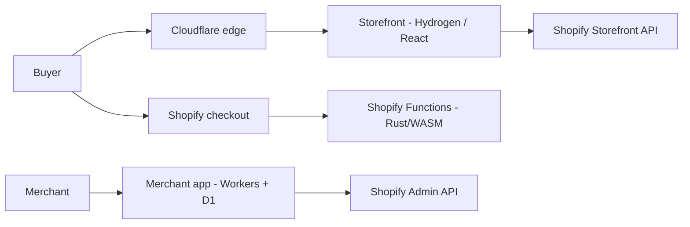

# RegenAI

**Headless Shopify commerce platform for recovery and wellness products** — a live 3D visual storefront with Hydrogen integration in progress, a merchant app on Cloudflare Workers, and Shopify Functions written in Rust.

**Live demo:** https://regenai.zahidul-islam.com

> RegenAI is a client-facing portfolio demo. Products are fictional, nothing is sold, no payment can be made, and no clinical claim is made. The visual storefront is live; Shopify integration is in progress. See [build status](docs/BUILD-STATUS.md) for exactly what is verified.

## What is in this repository

| Part | Package | Stack | Status |
|---|---|---|---|
| **Frontend** — customer storefront | [`packages/storefront`](packages/storefront/README.md) | React 18, TypeScript, Three.js, Vite; Hydrogen 2026.4 + React Router 7 | Visual storefront **live**; Hydrogen integration **in progress** |
| **Backend** — merchant app | [`packages/app`](packages/app/README.md) | React Router 7 on Cloudflare Workers, D1, KV, Polaris | Scaffold built; security release blockers open |
| **Backend** — Shopify Functions | [`packages/app/extensions`](packages/app/extensions/README.md) | Rust → WebAssembly | 4 Functions built; 47/47 unit tests pass |
| Design system | [`packages/ui`](packages/ui/README.md) | React, Radix, Tailwind v4, Storybook | 15 components built |
| Deployment | [`deploy/frontend`](deploy/frontend/README.md) | Docker, Nginx, Caddy, Cloudflare | Live frontend release |

## Architecture at a glance

Target architecture (the visual storefront is live; the Hydrogen, merchant-app and Function paths are being integrated):



Shopify owns catalog, cart, checkout, orders and payments; RegenAI never touches card data. Storefront servers are designed to be stateless so they scale horizontally behind a CDN. Full detail: [ARCHITECTURE.md](docs/ARCHITECTURE.md).

## Engineering targets

| Target | Design | Evidence today |
|---|---|---|
| **Scale:** 1M+ concurrent shoppers | CDN-first caching, stateless storefront, checkout on Shopify, queue-backed webhooks — [SCALABILITY.md](docs/SCALABILITY.md) | Capacity model documented; load tests not yet run |
| **Availability:** 99.9% target, 99.0% floor | Redundant origin, SLOs, error budgets, rollback, DR — [RELIABILITY.md](docs/RELIABILITY.md) | Release-archive restore verified; rollback not yet drilled; uptime not yet measured |
| **Security** | Threat model, strict CSP, hardened containers, secret scanning — [SECURITY-MODEL.md](docs/SECURITY-MODEL.md) | Frontend controls verified; merchant-app blockers listed openly |
| **Privacy & law** | Data minimisation; PCI, GDPR, US state privacy, health-product rules mapped — [COMPLIANCE.md](docs/COMPLIANCE.md) | Live demo collects no personal data; legal review required before real sales |
| **Accessibility** | WCAG 2.2 AA target — [ACCESSIBILITY.md](docs/ACCESSIBILITY.md) | Automated axe: 0 violations; keyboard and reduced-motion checks pass |

These are engineering targets with an explicit evidence trail. Nothing here claims capacity, uptime or legal compliance that has not been measured or reviewed.

## Quick start

Requirements: Node 24 LTS (see `.nvmrc`), npm 12. Rust stable with the `wasm32-wasip1` target for Functions.

```bash
npm install

# Run the visual storefront locally — no Shopify credentials needed
npm run dev:frontend          # http://127.0.0.1:3000

# Frontend-only checks (these gate the live release)
npm run typecheck:frontend
npm run build:frontend

# Shopify Function unit tests
cd packages/app && cargo test --workspace
```

`npm run dev` starts the Hydrogen integration environment and needs Shopify configuration; copy `packages/storefront/.env.example` to `.env` and fill values locally. Never commit real secrets.

Whole-workspace `npm run typecheck`, `npm run lint` and `npm run build` currently fail on the unfinished Hydrogen integration — this is tracked in [BUILD-STATUS.md](docs/BUILD-STATUS.md).

## Documentation

Full index: [docs/README.md](docs/README.md). Most useful:

- [Architecture](docs/ARCHITECTURE.md) · [Build status](docs/BUILD-STATUS.md) · [Roadmap](docs/ROADMAP.md)
- [Scalability](docs/SCALABILITY.md) · [Reliability](docs/RELIABILITY.md)
- [Security model](docs/SECURITY-MODEL.md) · [Privacy](docs/PRIVACY.md) · [Compliance](docs/COMPLIANCE.md) · [Accessibility](docs/ACCESSIBILITY.md)
- [Architecture decision records](docs/adr/) · [Master plan](PROJECT_PLAN.md)
- [Client overview](my-project-view/technical-overview.md) (dated snapshot; the current availability target is in [RELIABILITY.md](docs/RELIABILITY.md))

## Contributing and security

See [CONTRIBUTING.md](CONTRIBUTING.md) and the [Code of Conduct](CODE_OF_CONDUCT.md). Report vulnerabilities privately as described in [SECURITY.md](SECURITY.md) — not in public issues.

## License

Code is MIT licensed — see [LICENSE](LICENSE). Brand assets, 3D models, imagery and written content are not covered by the MIT license.
