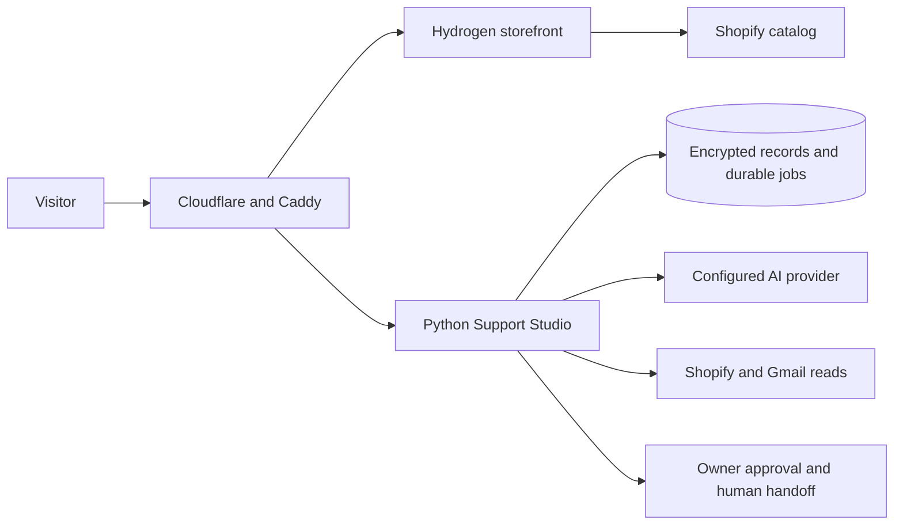

# RegenAI

Shopify storefront and Python customer support assistant by **Zahidul Islam**.

[Open the storefront](https://regenai.zahidul-islam.com) · [Open Support Studio](https://regenai.zahidul-islam.com/assistant) · [Documentation](docs/README.md)

The live Hydrogen storefront reads six owned Shopify catalog products and retains the original cream, navy and cobalt design, product photography and interactive 3D scenes. Support Studio adds customer chat, persistent memory, policy recommendations, owner approvals, human handoff and durable tasks. Public ordering is closed. Refunds and outbound customer email remain disabled until their complete external workflow is verified.

## Components and current scope

| Component | Technology | Current state |
|---|---|---|
| [Storefront](packages/storefront/README.md) | Hydrogen, React Router 7, React, TypeScript, Three.js | Live Shopify catalog, discovery, product pages, finder and informational routes |
| [Support assistant](services/assistant/README.md) | Python 3.12, FastAPI, encrypted SQLite | Live chat and owner console; isolated workspaces, approvals, audit and durable worker |
| Connections | Shopify Admin API, Gmail API | Installed support app with order read/write scopes; token renewal, Gmail support-label reads and restart persistence verified |
| AI | Configured model through OpenRouter | Two authorized checks passed: Spanish memory/image understanding and the $89 support recommendation |
| [Merchant app](packages/app/README.md) | React Router, Cloudflare Workers, D1 | Local authentication/privacy repairs tested; older public Worker routes disabled; remote release remains due |
| [Shopify Functions](packages/app/extensions/README.md) | Rust and WebAssembly | Three compiled Functions in an inactive draft; store activation remains due |
| [Design system](packages/ui/README.md) | React, Radix, Tailwind | Shared workspace package; separate from the current storefront theme |


```mermaid
flowchart LR
  Visitor[Visitor] --> Edge[Cloudflare and Caddy]
  Edge --> Storefront[Hydrogen storefront]
  Edge --> Assistant[Python Support Studio]
  Storefront --> Catalog[Shopify catalog]
  Assistant --> Records[(Encrypted records and durable jobs)]
  Assistant --> Model[Configured AI provider]
  Assistant --> Connections[Shopify and Gmail reads]
  Assistant --> Owner[Owner approval and human handoff]
```

Both services use immutable containers on the existing host. Local/live source, runtime artifacts, environment files and image identities have been compared. That evidence establishes release parity; it does not establish a million-user capacity result or continuous uptime. [Build status](docs/BUILD-STATUS.md) records the dated checks and remaining work.

## Engineering roadmap

| Objective | Design and acceptance |
|---|---|
| 1M+ simultaneous active users | [Capacity plan](docs/SCALABILITY.md) defines request rates, warm/cold caches, AI concurrency, quotas, storage migration, queues and phased measurement |
| 99.9% availability target; 99.0% floor | [Reliability plan](docs/RELIABILITY.md) defines journey SLIs, error budgets, independent failure domains, monitoring and restore drills; observed uptime is not yet measured |
| Security and privacy | [Threat model](docs/SECURITY-MODEL.md), [data inventory](docs/PRIVACY.md), least privilege, encrypted records, explicit approvals and source scans; remaining release gates are stated |
| Applicable law | [Compliance map](docs/COMPLIANCE.md) and [applicability register](docs/PRODUCTION-APPLICABILITY.md) cover privacy, AI transparency, consumer rights, product claims, accessibility and payment responsibilities |
| Accessible interaction | [WCAG 2.2 AA target](docs/ACCESSIBILITY.md); bounded axe, keyboard, responsive and reduced-motion checks exist; broader manual review remains due |

These are future objectives with measurable exit criteria. Current infrastructure is one host and one assistant database. A shared multi-client service and distributed deployment require further implementation and testing.

## Local setup

Use Node 24 LTS and npm 12 from the repository runtime files. The root lockfile owns the npm workspaces. Python requires 3.12 or newer. Functions use Rust and the documented WebAssembly target.

```bash
npm ci
npm run dev:frontend

# Full Hydrogen server: configure the private storefront environment first
npm run dev

# Python service: install in your own virtual environment
python -m pip install -e 'services/assistant[dev]'
```

Copy each service's `.env.example` into its private environment file and configure it as described in the [assistant operator guide](docs/ASSISTANT.md) and [Hydrogen deployment guide](deploy/hydrogen/README.md). Generate distinct encryption, owner, operator and MCP credentials. Select provider/model/pricing through typed configuration before enabling paid AI. Never put real credentials in code, command arguments or Git.

## Verification and release

```bash
npm test
npm run typecheck
npm run lint
npm run build
python -m pytest services/assistant/tests -q
python -m ruff check services/assistant
python -m mypy services/assistant/regenai_assistant
python -m bandit -r services/assistant/regenai_assistant -q
node --test .github/tests/publication-workflows.test.mjs
```

The [release guide](docs/RELEASE.md) covers local-first changes, drift detection, immutable packages, smoke checks, rollback and parity. Main requires an independent approving review. Optional Workers deployment and paid visual/load integrations require separate explicit opt-ins; pushing source alone must not activate them. Public standard-runner CI performs no paid inference.

See [contributing](CONTRIBUTING.md), [vulnerability reporting](SECURITY.md) and the [code of conduct](CODE_OF_CONDUCT.md). Code is MIT licensed; brand assets, product imagery, models and written content retain their separate rights. See [LICENSE](LICENSE).
