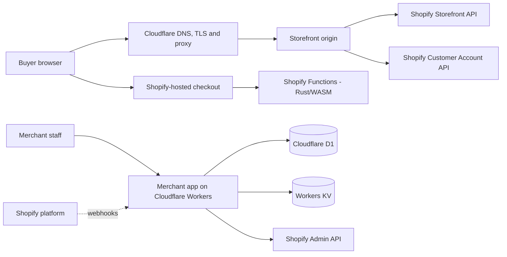

# Architecture

Updated 2026-09-24. This document describes how RegenAI is built today and the architecture it is being built toward. Every component carries a status label so a reader can tell what exists from what is planned.

| Label | Meaning |
|---|---|
| **Live** | Deployed and publicly reachable; verification evidence recorded |
| **Built** | Source exists in this repository and has local test evidence, but is not integrated or released |
| **Partial** | Source exists with known gaps or failing gates |
| **Planned** | Designed and documented; no implementation yet |

## 1. System context

RegenAI is a headless Shopify commerce platform for a recovery-and-wellness catalog. It is delivered as a client-facing portfolio demo with synthetic products. Shopify remains the system of record for catalog, inventory, cart, checkout, orders and payments; RegenAI never handles card data.



## 2. Components

### 2.1 Frontend — customer storefront (`packages/storefront`)

| Part | Technology | Status |
|---|---|---|
| Visual recovery storefront (home, collection, search, 6 product pages, recovery finder, bag, info pages) | React 18, TypeScript, Three.js, Vite static build | **Live** at https://regenai.zahidul-islam.com |
| Original 3D product assets | Blender-authored GLB models with still-image fallbacks | **Live** |
| Hydrogen integration (real catalog, cart, accounts, SEO routes) | Hydrogen 2026.4, React Router 7, Storefront API | **Partial** — route migration in progress; full-workspace build/typecheck currently fail |
| Node server adapter for self-hosted Hydrogen | Node 24, bounded public cache, safe logger, typed settings | **Partial** — focused tests pass; integrated HTTP/SSR acceptance pending |

The live build is a static single-page application served by an unprivileged, read-only Nginx container behind Caddy and Cloudflare. It makes no third-party network calls; its only browser storage is the demo bag (`localStorage` key `regenai:demo-bag:v1`). See [FRONTEND-DEPLOYMENT.md](FRONTEND-DEPLOYMENT.md) and [`deploy/frontend/`](../deploy/frontend/README.md).

### 2.2 Backend — merchant app (`packages/app`)

| Part | Technology | Status |
|---|---|---|
| Embedded merchant app shell and OAuth install/callback | React Router 7 on Cloudflare Workers, Polaris | **Partial** — a development scaffold is deployed to a `workers.dev` URL; release-blocking security repairs required (see [SECURITY-MODEL.md](SECURITY-MODEL.md)); not for real stores |
| Claim-review queue for product copy (`/admin/reviews`) | D1 table `clinician_review_queue` | **Partial** — read-only listing; no authentication or shop scoping yet; submission and approval flow planned |
| Persistence | Cloudflare D1 (SQLite semantics), Workers KV for OAuth state | **Built** — schema in `migrations/0001_initial.sql`; environments not yet isolated |
| Webhook intake | Shopify HMAC-verified webhooks → durable queue → idempotent workers | **Planned** |

### 2.3 Backend — Shopify Functions (`packages/app/extensions`)

Four Rust crates compiled to WebAssembly and executed by Shopify inside cart and checkout. They run on Shopify infrastructure, so they scale with Shopify, not with RegenAI servers.

| Function | Shopify target | Purpose | Status |
|---|---|---|---|
| `cart-contraindication` | `cart.checkout.validation.run` | Block checkout when a product's contraindication conflicts with a health flag on the signed-in customer (guests pass) | **Built** |
| `b2b-tiered-pricing` | `cart.transform.run` | Company-tier discount plus subtotal-based volume adder for B2B buyers, capped at 40% | **Built** |
| `delivery-customization` | `cart.delivery-options.transform.run` | Hide/rename delivery options by cart content | **Built** |
| `discount-stacking` | `cart.checkout.validation.run` | Enforce discount-combination rules | **Built** |

Verified 2026-09-24: native unit tests **47/47 pass** (`cargo test --workspace`), and release WASM builds are 159–181 KiB each, under Shopify's 256 kB limit. Not yet verified: schema revalidation against the current Function API version, and a store-level activation test. `cart-contraindication` reads a customer health-flag metafield; any real deployment requires the privacy review described in [PRIVACY.md](PRIVACY.md). Shopify permits Functions in **custom** apps only on Shopify Plus stores ([Shopify Functions limits](https://shopify.dev/docs/api/functions/latest)); a non-Plus store would need public-app distribution.

### 2.4 Design system (`packages/ui`)

`@regenai/ui` — 15 React components, most built on Radix primitives, styled with Tailwind v4; Storybook stories for four of them so far. **Built**, used locally; not published to npm and not used by the live demo.

## 3. Trust boundaries and data flow

| Boundary | What crosses it | Control |
|---|---|---|
| Browser → Cloudflare edge | HTTPS requests | TLS at edge; Cloudflare proxy; origin certificate trust and hostname verified during release |
| Edge → origin | Proxied requests | Origin listens on loopback behind Caddy; only GET/HEAD accepted by the static frontend |
| Origin → Shopify Storefront API | Public catalog queries, cart mutations | Public/private token separation; buyer IP forwarded with `Shopify-Storefront-Buyer-IP` (planned for the Hydrogen server) |
| Browser → Shopify checkout | Payment and address data | Entirely on Shopify-hosted checkout; never touches RegenAI servers |
| Shopify → merchant app | OAuth callbacks, webhooks | HMAC verification; state parameter; per-shop authorization (repair in progress) |
| Merchant app → D1/KV | Sessions, tokens, review queue | Encryption-at-rest for tokens and per-shop query scoping are release gates |

Full threat model: [SECURITY-MODEL.md](SECURITY-MODEL.md). Data inventory: [PRIVACY.md](PRIVACY.md).

## 4. Hosting and deployment

| Layer | Current | Target |
|---|---|---|
| Static frontend | One Docker container on a single VPS, Caddy reverse proxy, Cloudflare proxy | Replaced by the Hydrogen server once integrated |
| Hydrogen storefront | Not deployed | Stateless Node containers behind a load balancer; public-page CDN caching; scales horizontally (see [SCALABILITY.md](SCALABILITY.md)) |
| Merchant app | Development scaffold deployed to a `workers.dev` URL; environments share one D1 database and KV namespace | Isolated preview/staging/production D1 and KV; authenticated routes; Cloudflare Workers auto-scaling |
| Functions | Built locally | Released through Shopify CLI (`shopify app deploy`) |

Releases are immutable: each frontend build goes to a new release directory, the previous release is retained, and rollback re-selects the previous release. Deploys follow a local-first rule — local is the source of truth, and every deployment ends with a byte-parity check between local artifact and live server.

## 5. Key decisions

Architecture decision records live in [`docs/adr/`](adr/). The most consequential:

- [ADR-001](adr/ADR-001-why-hydrogen-over-liquid.md) — Hydrogen headless instead of a Liquid theme
- [ADR-008](adr/ADR-008-shopify-functions-over-scripts.md) — Shopify Functions instead of deprecated Scripts
- [ADR-011](adr/ADR-011-oxygen-unavailable-cf-workers-activated.md) — Oxygen unavailable, Cloudflare Workers fallback (historical; hosting target has since moved to self-hosted Hydrogen)
- [ADR-021](adr/ADR-021-custom-app-cf-workers-d1.md) — merchant app on Workers + D1 (historical; its KV-for-OAuth-state assumption is superseded — KV is eventually consistent and not suitable for one-time state)

## 6. Repository map

```
regenai/
├── packages/
│   ├── storefront/        Frontend: live visual storefront + Hydrogen integration
│   ├── app/               Backend: merchant app (Workers + D1) and Shopify Functions (Rust)
│   └── ui/                Design system (@regenai/ui) + Storybook
├── deploy/frontend/       Container, Nginx and Caddy templates for the live frontend
├── docs/                  Architecture, security, reliability, scale, compliance, roadmap, ADRs
├── scripts/               Workspace helpers (native-binding rebuild, storefront runner)
└── .github/               CI workflows, Dependabot, issue/PR templates
```
