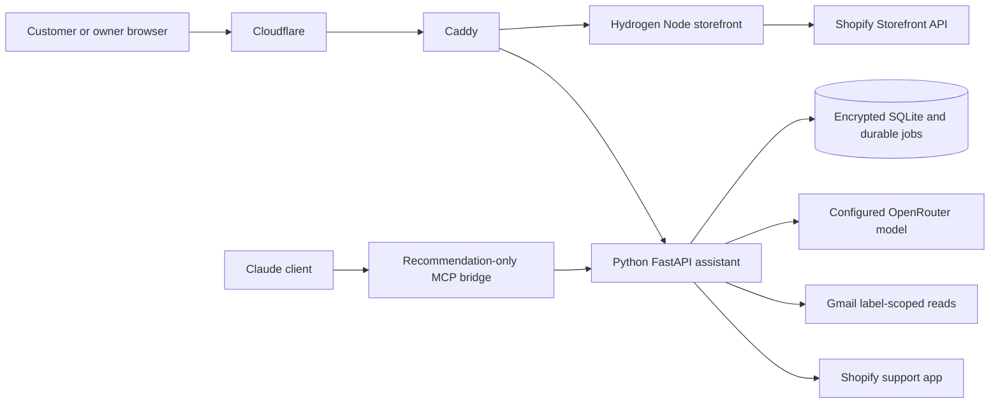

# Architecture

Updated 2026-10-08. RegenAI combines a Shopify-backed storefront with a Python support assistant. Public ordering is closed. Components described as planned or locally tested have their own release gates.

## Current application

```mermaid
flowchart LR
  Browser[Customer or owner browser] --> Edge[Cloudflare]
  Edge --> Router[Caddy]
  Router --> Web[Hydrogen Node storefront]
  Router --> Support[Python FastAPI assistant]
  Web --> Catalog[Shopify Storefront API]
  Support --> DB[(Encrypted SQLite and durable jobs)]
  Support --> AI[Configured OpenRouter model]
  Support --> Inbox[Gmail label-scoped reads]
  Support --> Orders[Shopify support app]
  Claude[Claude client] --> Bridge[Recommendation-only MCP bridge]
  Bridge --> Support
```

| Layer | Current behavior and boundary |
|---|---|
| Frontend | React/Hydrogen, React Router, TypeScript and Three.js; six owned Shopify catalog products and maintained content; same-origin customer chat |
| Routing | Caddy selects the support service for its path and Hydrogen for storefront routes; host ports bind to loopback |
| Assistant API | Public workspace sessions plus distinct owner, operator and recommendation-only MCP access; explicit origin and mutation checks |
| Memory | Encrypted messages/preferences/context; erase controls; structured database identifiers and timestamps remain unencrypted metadata |
| Durable work | Leased jobs with bounded attempts, expiry and quarantine; retention maintenance and owner-scheduled tasks |
| AI | Configured provider URL/model/pricing; reservations and daily/total/session budgets; image analysis and multilingual responses tested in two authorized calls |
| External integrations | Shopify installed support app renewal/read and Gmail installed-client refresh/label reads verified; outbound actions remain disabled |
| Human handoff | Internal review state and complete conversation/audit bundle; external staff notification and staffing remain client responsibilities |

The worker is active, but this release does not activate recurring inbox review/import schedules. An empty-label one-shot import passed. Browser voice uses browser services and installed voices; it is not a server media-generation service. HTTPS retrieval is allowlisted and its content is untrusted model context.

## Approval and action boundary

The support app grants only order read/write scopes on the owned development store. An empty order read does not establish protected-customer-data permission or a successful refund. The current Gmail grant is encrypted and scoped to read/send with a maintained dedicated-label import query. The Google project remains in Testing, so the seven-day grant expiry must be addressed before unattended client operation.

Real actions require owner approval bound to the exact ticket version, reply, recipient, amount and active policy. Execution locks the order, records the refund receipt before replying and holds ambiguous outcomes for reconciliation. Workspace approval changes workspace records only. A model recommendation never grants permission to spend or send.

## Additional project components

| Component | Source and verified state |
|---|---|
| Merchant app | `packages/app`: standalone React Router/Workers/D1 app. Local opaque sessions, shop-bound AES-GCM tokens, atomic OAuth state, authenticated shop-scoped review reads, uninstall and three privacy webhook topics tested. Remote isolation, migrations, subscriptions and delivery remain due. Older public Worker routes are disabled. |
| Shopify Functions | Three Rust Functions compiled against the 2026-01 schema and uploaded in an inactive draft. Store-level activation is unverified; B2B line updates require eligible Shopify capabilities. Discount rules need a supported API redesign. |
| Shared UI package | Fifteen Radix/Tailwind components for workspace reuse; four Storybook examples. It is not the source of the storefront's current design tokens. |

## Configuration and trust boundaries

Secrets enter through private runtime environments or encrypted connection records. Frontend and assistant each have a typed configuration boundary; maintained product content and prompts live in data/template files. Examples contain safe values only. Images, ports, database paths, timeouts, budgets, models and API versions are release configuration.

Browser sessions use secure HttpOnly cookies, private responses bypass shared caches, and per-workspace records stay isolated. Assistant containers run as a non-root user with a read-only filesystem; only their durable data mount is writable. Merchant authorization must use the authenticated shop on every query, with webhook HMAC verification before payload processing. External URLs and OAuth grants require provider-specific validation.

## Deployment and future growth

Two immutable service images run on one existing host. Release manifests prove uploaded source, image/runtime artifacts, private environment and routing parity. Historical static storefront artifacts are retained. Local source is authoritative; live-ahead drift must be reconciled before deployment.

The [capacity plan](SCALABILITY.md) proposes independent storefront hosts, distributed assistant storage, tenant-aware authorization, durable shared queues, provider admission control and eventually multi-region recovery. Those changes require implementation and workload evidence. The present SQLite deployment must not be advertised as a shared multi-client service or million-user system.

[Release](RELEASE.md) · [Reliability](RELIABILITY.md) · [Security](SECURITY-MODEL.md) · [Privacy](PRIVACY.md) · [Architecture decisions](adr/)
