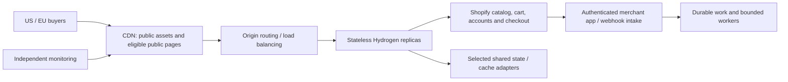

# Scalability and production evidence guide

Updated 2026-09-21. Derived from the [master build plan](../PROJECT_PLAN.md), which owns acceptance criteria and task dependencies.

**Status: planned architecture, not demonstrated capacity.** The owner requests a credible path from 10k to 1M+ simultaneous active users and a 99% availability objective. Neither traffic capacity nor observed production uptime has been established. The current customer preview uses local fixtures; existing Shopify integration and release infrastructure require the plan's repair and verification gates.

The design goal is to preserve commerce and application interfaces while increasing infrastructure capacity. This reduces avoidable rewrites; it does not make every future upgrade a small configuration change. Shopify limits, dynamic workload, database behavior, cache misses, bandwidth and operational recovery remain independent constraints.

## What reviewers must find in the codebase

The following are **required future deliverables**, not claims that these modules exist now. Implementation begins only after the owner's start command. Concrete module names are selected during the runtime and configuration audit; do not create empty scaffolding to satisfy this table.

| Plan task | Required executable evidence | How the documentation will prove it |
|---|---|---|
| B04, S02 | Central typed configuration; request handlers using injected cache/session/job/telemetry boundaries where needed | Link each real implementation and its environment schema; list supported adapters and limits |
| S02, S05 | Stateless storefront replicas; correct sessions, tenant isolation and cart ownership across nodes | Link alternating-node integration test, deployment configuration and actual result |
| S03 | Public-only cache policy, bounded upstream access, coalescing and graceful dependency failure | Link cache-key/privacy tests, cold-cache tests and controlled upstream outage evidence |
| C07, S03 | Durable webhook/job handling with verification, idempotency, retries and recovery | Link duplicate delivery, worker-crash and dead-letter replay tests |
| S01, S04 | Tracked workload profiles and runnable k6 scenarios under proposed `tests/load/`; CI thresholds that fail | Link workload assumptions, generator configuration, measured throughput/latency/errors and dropped iterations |
| S05 | Reproducible local multi-instance setup and deployment templates under proposed `deploy/` | Link fresh-setup, rolling restart and failed-replica evidence; distinguish same-host tests from host redundancy |
| P08, P09 | Redacted telemetry, external probes, alert rules and recovery runbooks | Link injected-failure and restore evidence; report observed uptime window separately |
| S06, S07 | Capacity decision register and authorized scaling experiments | Link bottleneck evidence, upgrade classification, provider constraints and highest measured capacity |
| P01–P10 | Security, privacy, accessibility, SEO/AI-search and performance controls | Link actual source, test, dated result and unresolved applicability/review decisions |

Each evidence entry must contain: task/control ID, implementation path, test path, command, commit or artifact identifier, environment/workload, result/date, reviewer verdict and limitation. Missing evidence is labeled **planned**, **implemented but unverified**, or **blocked**. Never equate a diagram, adapter interface or mock benchmark with production proof.

## Intended runtime responsibilities

This is the target topology. The initial storefront target is the existing VPS, subject to Node-runtime validation. The merchant app initially retains its Workers/D1 deployment model, subject to security and environment-isolation repairs. Shopify remains the commerce system of record. A shared VPS is a single host failure domain; multiple containers on it do not establish host redundancy. Paid or managed services in this topology require separate selection and authorization.

## What changes when demand grows

| Change category | Examples | Required before claiming it works |
|---|---|---|
| Configuration only, once implemented | Replica count within available resources; supported adapter endpoint; cache policy within safe bounds | Existing adapter/contract tests pass; capacity and upstream limits checked |
| Infrastructure addition | Independent hosts, load balancer, external monitoring, larger queue/cache, offsite backups | Provisioning, routing, security, failover, observability and budget verification |
| Data migration | Moving state storage, changing queue semantics, repartitioning an actual bottleneck | Data correctness, concurrency semantics, migration/rollback and recovery rehearsal |
| Application change | Fixing inefficient queries, contention, cache personalization bugs or a saturated synchronous path | New acceptance criteria, implementation, regression tests and independent review |
| Provider/commercial change | Shopify eligibility/capacity review, CDN/egress limits, managed-service plans | Current provider documentation/account verification and explicit spending approval |

S06 must turn these examples into an evidence-backed bill of materials: current bottleneck, proposed service/capacity, exact configuration or code affected, migration effort, cost units and dated quote, rollback and approval status. A million-user target does not itself select a server size or justify Kubernetes, microservices or sharding.

## Capacity and reliability statements

The master plan defines the workload model, illustrative request-rate calculation and tier progression. Active sessions, requests per second and concurrent checkout mutations are different measurements. Cached browsing and cold-cache dynamic traffic need separate tests. Shopify's [API limits](https://shopify.dev/docs/api/usage/limits) must be modeled per API; Storefront buyer traffic treatment is not a guarantee of unlimited checkout throughput.

The 99% objective uses the master plan's rolling 30-day, per-region/per-journey definition. It allows 432 minutes of downtime in a complete 30-day window. Observed achievement requires actual monitoring data; local failure tests prove only the behaviors exercised.

Use this claim format after testing: “This artifact sustained **measured workload X** on **infrastructure Y**, with **latency/error results Z**, for **duration D**; **dependencies and limitations L**.” Until then, say “Designed toward the documented target; capacity unverified.”

## Cost and authorization

The baseline favors existing infrastructure and suitable free/open-source tooling. Free software does not mean free compute, bandwidth, retained logs, backups or large distributed load tests. The plan requires explicit cost/approval gates for paid services and scoped authorization for remote/high-volume tests. No large load test, new service, paid resource or deployment was started by this documentation update.

## Local validation tools

Latest local-tool verification on 2026-09-21 supersedes the earlier unreachable-engine result: Docker client and engine both responded with version 29.7.2. Docker Desktop Kubernetes subsequently reported starting (kind, one node, v1.36.1), no error, and no registered docker-desktop context yet. Readiness remains unverified. The owner explicitly authorizes using and modifying local Docker/Kubernetes configuration as needed for RegenAI, with project isolation and explicit local-context verification; unrelated cloud clusters remain outside scope. Full project implementation still awaits the start command.

Start with isolated Compose replicas; use local Kubernetes where it adds useful restart/rollout evidence. Keep resource limits, deployment templates and repeatable tests in the codebase.
